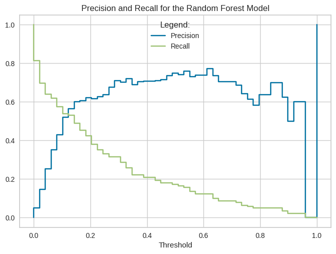
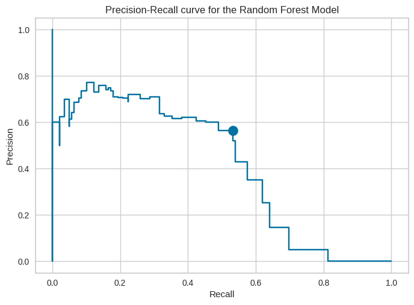

# Fraud detection in credit card transaction data with PyCaret

We use the high level API [PyCaret](https://github.com/pycaret/pycaret) and the outlier detection package [PyOD](https://github.com/yzhao062/pyod) to detect outliers (i.e. anomalies or possible fraudulent transactions) in a [credit card transaction dataset](https://www.kaggle.com/datasets/mlg-ulb/creditcardfraud). We also compare our results to those in the benchmark paper [ADBench](https://arxiv.org/abs/2206.09426).

One of the major factors to consider in this project is that most credit card transactions are valid. In our dataset, the column 'Class' corresponds to weather the transaction is valid (Class = 0) or fraudulent (Class = 1).  We compute the mean over this column:

	dataset["Class"].mean()
	--> 0.001727485630620034

We see that only 0.17% of the transactions are fraudulent. Our dataset is heavily imbalanced and the fraudulent transactions are considered outliers. We will now consider which metrics and models will perform well under these conditions.

# Files

- [ ] choose_models_PyCaret.ipynb : Jupyter Notebook to choose 4 of the best models from those available in the PyCaret API
- [ ] compare_models_PyCaret.ipynb : Jupyter Notebook to compare the 4 chosen models. Also computes the optimal Threshold Hyperparameter

# Metric Selection

We use the AUC ROC and F1 score as our metrics we wish to maximize (see [this article](https://towardsdatascience.com/accuracy-precision-recall-or-f1-331fb37c5cb9) for a more detailed explanation on precision/recall tradeoff for imbalanced classes). We will now give a brief explanation for our decision to prioritize these measures.

Notice that the dataset is very imbalanced. Only 0.17% of transactions are fraudulent ('Class' = 1), so a model that predicts every transaction is valid would immediately have an accuracy of 99.83% . Therefore, we care more about precision and recall than we do accuracy. A model with a large AUC ROC will score well in precision and recall for our choice of threshold hyperparameter.

Indeed, we interpret precision as the percentage of transactions we detect as fraudulent that are actually fraudulent, as determined by the formula:

```math
\text{Precision} = \dfrac{ \text{True Pos} }{ \text{True Pos + False Pos} } \, . 
```

$ \text{Precision} = \dfrac{ \text{True Pos} }{ \text{True Pos + False Pos} } \, . $

In other words, if precision is low then the model will flag more transactions as fraudulent that, in reality, are valid. This will result in upset customers falsely accused of fraud.

On the other hand, we interpret recall as the percentage of all the truly fraudulent cases that the model is able to detect, as seen in the formula: 

$ \text{Recall} = \dfrac{ \text{True Pos} }{ \text{True Pos + False Neg} } \, . $

In other words, if recall is low, then there are fraudulent transactions that our model is just not able to detect.

This is the **precision/recall tradeoff**. By lowering the threshold hyperparameter, we will have lower precision but higher recall. The model will be more sensitive to outliers. It will detect more cases of fraud, but result in more upset customers. On the other hand, increasing the threshold hyperparameter will make the model less sensitive. It will ignore the transactions that are somewhat suspicious, resulting in fewer upset customers, but missing some of the borderline fraud cases. A model with high AUC ROC and F1 score will capture the optimal solution to this tradeoff problem, resulting in models that have both a high precision and a high recall. We then will then consider the choice of threshold hyperparameter to find a precision/recall combination that we are happy with.


# Model Selection
 
## First, consider the supervised classification algorithms.
Since the data is labeled, we know which transactions are valid and fraudulent. Therefore, we first consider this to be a supervised classification problem and consider the corresponding algorithms.  

To get started, we set up the supervised machine learning problem using PyCaret (which also does the preprocessing & data imputation) and compare various models:

	# import pycaret classification and init setup
	from pycaret.classification import *
	supervised = setup(dataset, target = 'Class', session_id = 123)
	
	# compare baseline models
	best = compare_models()


From this investigation, we have our canditates for the best supervised models:


*   Random Forest Classifier
	*  AUC ROC 0.9566 (6th best)
	*   F1 0.8668 (best)

* xgboost
	* AUC ROC 0.9827 (best)
	* F1 0.8641 (second best)


In the next section, we will consider the effect of dropping the 'Class' column. In the real world, financial institutions do not have a labeled dataset of valid/fraudulent transactions to train machine learning algorithms on, so this experiment will be more applicable. Additionally, the [ADBench](https://arxiv.org/abs/2206.09426) paper suggests that unsupervised algorithms outperform the supervised algorithms. The reason for this is that supervised algorithms can only learn and detect types of fraud similar to the cases that appear in the training data. On the other hand, the unsupervised algorithms look for any type of anomalous behavior.

## Now, consider the unsupervised algorithms.

We refer to [ADBench](https://arxiv.org/abs/2206.09426) to help us select a few models that typically work well for fraud detection. ADBench has the results:


* LOF
	* AUC ROC 0.9492 (second best)
	* AUC PR 0.4740 (third best)

* KNN
	* AUC ROC 0.9356 (third best)
	* AUC PR 0.4730 (4th best)

Both models are able to be implemented through PyCaret. 

Now that we have chosen our 4 models (Random Forest, XG boost, LOF, and KNN), we will compare the results of these algorithms on a test set.

# Results

We now display our results. The best performing model is the Random Forest Classifier. We how the Precision and Recall graphs for choices of Threshold.



The question remains, how to choose the optimal threshold? Notice that the best possible Precision/Recall pair is the point (1,1). This is a fictitious model that has 100% Precision and Recall, but it is something to aim for. Below, we code a for loop that computes the threshold which gives (prec, recall) closest to the point (1,1) :


	# Compute optimal threshold:
	len = precision_rf.shape[0]
	dist = np.zeros( len )

	x = range( len )
	for n in x:
	  dist[n] = np.sqrt( (1-precision_rf[n])**2 + (1-recall_rf[n])**2 )

	index = np.argmin(dist)  # Index where (prec, recall) has minimum distance to the optimal point (1,1)

	optimal_prec_rf = precision_rf[index]

	optimal_recall_rf = recall_rf[index]

	print(' The best Precision-Recall pair for the Random Forest Model is: Prec = ', optimal_prec_rf, ' and Recall = ', optimal_recall_rf)


	#Plot the Prec-Recall curve

	pr_display_rf = PrecisionRecallDisplay(precision=precision_rf, recall=recall_rf).plot()
	plt.title('Precision-Recall curve for the Random Forest Model')

	plt.plot(optimal_recall_rf,optimal_prec_rf, 'bo', linewidth=2, markersize=12)  # plot x and y using blue circle markers

	plt.show()

	---> The best Precision-Recall pair for the Random Forest Model is: Prec =  0.5648854961832062  and Recall =  0.5323741007194245


We draw a dot at the point with optimal Precision-Recall pair, (0.56, 0.53). 

We would like to see better Precision and Recall than the above results. For future work, we would consider further hyperparameter tuning (beyond tuning just the threshold parameter). We would also consider more sophisticated methods to handle the class imbalance, such as [downsampling the valid transactions & upweighting the fraudulent ones](https://stats.stackexchange.com/questions/569878/upweight-minority-class-vs-downsampleupweight-majority-class) or the methods in the Python package  [imbalanced-learn](https://imbalanced-learn.org/stable/).


# References

- [ ] [PyCaret](https://github.com/pycaret/pycaret) GitHub
- [ ]  [PyOD](https://github.com/yzhao062/pyod) GitHub
- [ ]  [credit card transaction dataset](https://www.kaggle.com/datasets/mlg-ulb/creditcardfraud)
- [ ]  [ADBench](https://arxiv.org/abs/2206.09426) paper
- [ ] [downsampling the valid transactions & upweighting the fraudulent ones](https://stats.stackexchange.com/questions/569878/upweight-minority-class-vs-downsampleupweight-majority-class) Stack Exchange
- [ ] [imbalanced-learn](https://imbalanced-learn.org/stable/) Python Package
